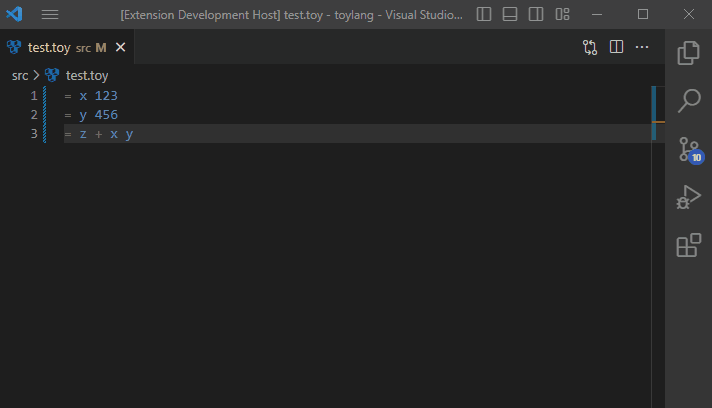

<h1> Toylang extension for Visual Studio Code</h1>

This extension adds support for Swiftaff/Toylang to Visual Studio Code. It currently features:

-   basic syntax highlighting
-   file icons
-   on-save error checking via Toylang Server (one error at a time)

To temporarily install this for use in your toylang repo (based on this: https://code.visualstudio.com/api/working-with-extensions/publishing-extension#packaging-extensions)

-   install vsce globally `npm i vsce -g`
-   cd to this toylang-vscode repo and run `vsce package` which saves a file `toylang-0.1.0.vsix`
-   copy this file to your toylang repo, cd to your toylang repo and run `code --install-extension toylang-0.1.0.vsix`
